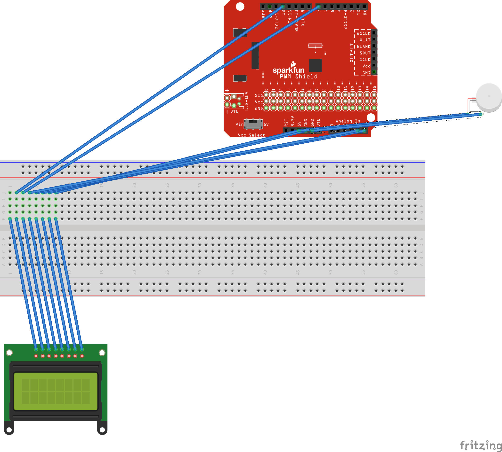

*Name:*  Rob Arcand  

*Date:* December 9, 2017

## Project:  FitLess

FitLess is a health monitor that problematizes traditional assumtions about wearable fitness devices. Where once such device were offered to collect data for personal use, we've seen a growing shift toward biometrics as a serveillence tool for both employers and insurance companies alike. Masked in the artiface its plastic "black box" casing, the device reduces health to a simple binary between "healthy" and "unhealthy," illuminating the limitations of reductive quantification, particularly in the shift from personal to corporate use.

### Detailed Project Description

<Biometric data has provided solutions to problems we didn't have, answers to we questions we haven't asked. Beyond the insecurity of the data they surrender to corporate control, do fitness trackers really necessarily solve any issues? Such devices ask new questions about what "healthy living" looks like through a useful computational lens, but as a topic that once relied on a broad variety of both qualitative and quantitative data, does this shift to pure computation adequately account for the many broad definitions of health present across the lines of size, race, gender, and ethnic identity? And with data from devices like FitBit increasingly requested by insurers, are we marching toward a future where simple differences in biometrics could increasingly limit healthcare coverage in the same way similar pre-existing conditions already operate today?

FitLess is not a solution to your problem. With a simple binary representation between "healthy" and "unhealthy," the device turns biometric heartrate data into a statement representative of the whole totality of healthy experience, exposing the limitations embedded within the use of even the most complex quantifications of what was once a largely qualitative process. Through this simple distinction, the device illuminates the limits of all biometric data, limited in their computational approach from the start. 

This simple solution of the many vastly complex questions of health and healthiness is indicative of larger mindset native to the logic of Silicon Valley called "Solutionism." In the same way architects and urban planners often find "sexy, monumental, and narrow-minded solutions" to sociocultural issues that are "extremely complex, fluid, and contentious," Solutionism (as defined by Evgeny Morozov in his book To Save Everything, Click Here) offers an easy, short-sighted fix for questions many aren't asking in the first place, especially on the current scale of mass consumerism. "These are the kinds of problems that, on careful examination, do not have to be defined in the singular and all-encompassing ways that 'solutionists' have defined them," he writes. "What’s contentious, then, is not their proposed solution but their very definition of the problem itself." 

### Technical Description

FitLess uses a Pulse Sensor to collect the simpliest reading of heartrate data into its system. Then, through a Photon Redboard provided with a simple code, an OLED screen provides a simple binary reading of health. Once again shielded within the sleek "black box" metaphor, the piece provides this reading with as little context as possible and no indicators for how such biometric data will be used in critique other devices that seek to veil biometric data and the third-parties such data is supplied to. 

#### Hardware Wiring Diagram



#### Code

< Explain your code.  You might include code snippets, either `inline` or
```c++
#include "PulseSensorPlaygroundh.h"

// This #include statement was automatically added by the Particle IDE.
#include <SparkFunMicroOLED.h>

#define PIN_OLED_RST D6  // Connect RST to pin 6
#define PIN_OLED_DC  D5  // Connect DC to pin 5 (required for SPI)
#define PIN_OLED_CS  A2  // Connect CS to pin A2 (required for SPI)
MicroOLED oled(MODE_SPI, PIN_OLED_RST, PIN_OLED_DC, PIN_OLED_CS);

//  Variables
int PulseSensorPurplePin = 0;        // Pulse Sensor PURPLE WIRE connected to ANALOG PIN 0
int LED = 7;   //  The on-board Arduion LED


int Signal;                // holds the incoming raw data. Signal value can range from 0-1024
int Threshold = 3250;            // Determine which Signal to "count as a beat", and which to ingore.


void setup() {
    
    pinMode(LED,OUTPUT);         // pin that will blink to your heartbeat!
    Serial.begin(9600);         // Set's up Serial Communication at certain speed.
    
    oled.begin();
    oled.clear(ALL);
    oled.display();
    
    delay(1000);

    oled.clear(PAGE);
    
    oled.setFontType(0);
}

void loop() {
    
  Signal = analogRead(PulseSensorPurplePin);  // Read the PulseSensor's value.
                                              // Assign this value to the "Signal" variable.

   Serial.println(Signal);                    // Send the Signal value to Serial Plotter.


   if(Signal > Threshold){                          // If the signal is above "550", then "turn-on" Arduino's on-Board LED.
     //digitalWrite(LED,HIGH);
     text("healthy");
   } else {
    //digitalWrite(LED,LOW);  //  Else, the sigal must be below "550", so "turn-off" this LED.
    text("unhealthy");
        }


delay(10);

}

void text(String textToPrint) {
    int middleX = oled.getLCDWidth() / 2;
    int middleY = oled.getLCDHeight() / 2;
    
     oled.clear(PAGE);
     
     oled.setCursor(middleX - (oled.getFontWidth() * (textToPrint.length()/2)), middleY - (oled.getFontWidth() / 2));
     oled.print(textToPrint);
     oled.display();
}
```

### Design / Form

I wanted to build off the original design for my midterm project in making use of the blackbox prototype, which continues to be prescient metaphor for a lot of what goes on beneath the surface of many everyday devices. From there, I adapted pieces from the SparkFun kit including the OLED and a Pulse Sensor I later purchased to collect biometric data and convert it be represented on the visual display.

(images/closed.png)

(images/open.png)

### Evaluation / Reflection

This project taught me a lot about how to approach conceptual challenges in design. Initially, I came to the piece with this fairly-specific "Solutionist" idea in mind, ultimately having a bit of a difficult time figuring out how best to execute such a critical idea in code. This tension feels central to what we first explored within this idea of "critical making," and it's something that seems increasingly necessary as we venture forward into a future where such data malpractices comes even further into focus.

The project allowed me to explore my interest in theory, while also allowing me to further develop skills in critical thinking through code. Looking back, part of me wishes I could have attempted something on a larger scale with more impact. Though I'm still unsure where my future in physical computing will take me, it feels like we covered a wealth of fascinating topics condusive to further research in a number of areas.